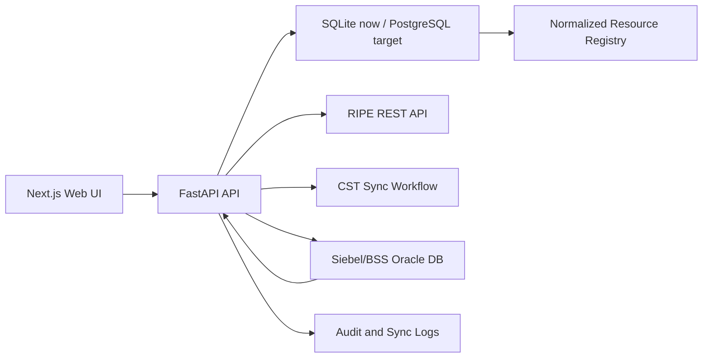
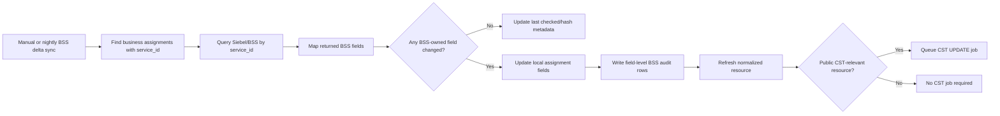

# Salam LIR Documentation

## 1. Purpose

Salam LIR is an IP resource registry and assignment management application for managing Salam LIR IPv4 resources, customer assignments, RIPE synchronization work, CST/LIR registry synchronization, and BSS/Siebel customer data enrichment.

The application keeps a normalized view of IP resources while preserving operational workflows around assignment, reservation, release, reporting, and external system synchronization.

## 2. Main Capabilities

- Resource Registry for managed IP pools, child pools, free blocks, assignments, and RIPE-discovered resources.
- Assignment Management for business customer, individual, and internal assignments.
- Business customer detail lookup from Siebel/BSS by service ID.
- BSS delta sync for all active business assignments with service IDs.
- CST sync workflow for public resources.
- RIPE discovery, RIPE allocated pool sync, RIPE assignment reporting, and RIPE worklist operations.
- Administration for users, RIPE settings, CST settings, Siebel settings, policies, and registry health.
- Audit trail for operational changes and external synchronization activity.
- Bulk import for pools and assignments.
- Conflict and integrity checks for overlaps, orphan resources, and invalid allocations.

## 3. Technology Stack

| Layer | Technology |
| --- | --- |
| Frontend | Next.js 15, React 19, TypeScript |
| UI | Tailwind CSS, local shadcn-style components, lucide-react icons |
| State and data fetching | TanStack React Query, Axios |
| Charts | Recharts |
| Backend | FastAPI, Python |
| Current local database | SQLite at `backend/ipam.db` |
| Target production database | PostgreSQL |
| BSS/Siebel integration | Python `oracledb` package |
| RIPE integration | RIPE REST API |
| CST integration | Local CST sync job and ledger workflow |

## 4. Runtime Services

| Service | Default URL | Purpose |
| --- | --- | --- |
| Web UI | `http://127.0.0.1:8082` | Main user interface |
| FastAPI API | `http://127.0.0.1:3001` | Backend API |
| API health | `http://127.0.0.1:3001/health` | Service and DB status |
| Swagger UI | `http://127.0.0.1:3001/docs` | Interactive API documentation |
| OpenAPI JSON | `http://127.0.0.1:3001/openapi.json` | API contract |

The frontend uses `NEXT_PUBLIC_API_URL` when configured. If it is not configured, it uses `http://127.0.0.1:3001`.

## 5. Application Structure

```text
SalamLIR/
  app/
    page.tsx              Main Next.js application UI
    layout.tsx            Root layout
    providers.tsx         React Query/provider setup
    [...path]/page.tsx    Catch-all route support
  backend/
    main.py               FastAPI routes, schema setup, sync workflows
    requirements.txt      Python dependencies
    ripe_integration_service.py
    ipam_core_services/   Service-layer direction for inventory, audit, assignment
  components/ui/          Shared UI components
  lib/
    api.ts                Frontend API client and TypeScript types
  scripts/                Local startup/support scripts
  public/                 Static web assets
  docs/                   Project documentation
```

## 6. Core Concepts

### 6.1 Pool

A pool is a managed IP network registered in the local LIR inventory. Public allocated pools are expected to come from RIPE synchronization. Private pools may be registered locally.

Important pool concepts:

- CIDR
- prefix and size
- start and end IP
- lifecycle/status
- source
- owner and administrative metadata

### 6.2 Assignment

An assignment consumes a managed subnet or range and attaches it to an owner context.

Supported assignment types:

- `business_customer`
- `individual`
- `internal`

Business assignments are the main scope for BSS/Siebel lookup and delta sync.

### 6.3 Normalized Resource

The `ip_resources` table is the normalized operational view used for inventory, reporting, CST sync, and registry browsing. Pools and assignments are synchronized into this table.

### 6.4 Assignment Details

The `assignment_details` table stores richer customer, contact, service, and BSS metadata joined to normalized resources by `resource_uuid`.

### 6.5 Audit

Operational changes are written to `audit_events`. BSS field-level changes are written to `bss_sync_audit`.

## 7. High-Level Architecture



## 8. Main User Workflows

### 8.1 Resource Registry

Resource Registry contains panels for:

- RIPE Discovery
- RIPE Worklist
- CST Sync Monitor
- Subnet Navigator
- Register Subnet, currently disabled and kept for private pools only

Public allocated pools are expected to be synchronized from RIPE. Private local pools can be registered locally when the feature is enabled.

### 8.2 Assignment Management

Assignment Management supports:

- Selecting an available subnet or range
- Choosing assignment target type
- Entering business, individual, or internal details
- Querying Siebel/BSS for business customer details by service ID
- Creating the assignment
- Suspending, resuming, refreshing BSS, or releasing existing assignments

### 8.3 Administration

Administration contains:

- Registry Health
- Recent Transactions
- User and role management
- RIPE integration settings
- Siebel integration settings
- BSS delta sync action
- Registry policies

## 9. BSS/Siebel Integration

### 9.1 Purpose

BSS/Siebel is treated as the source of truth for business customer and service details. Salam LIR stores a synchronized snapshot for assignment, reporting, audit, and CST sync.

### 9.2 Lookup Key

The reliable lookup key is:

```text
service_id
```

Customer ID is not used as the matching key because it is not reliable enough for this flow. Customer ID and BSS customer ID are stored only as returned attributes.

### 9.3 Siebel Configuration

Configured under Administration, Siebel Integration:

- username
- password, stored via the application secret handling
- DSN
- connection timeout
- SQL query

The configured SQL must be a `SELECT` statement and must include the bind variable:

```sql
:service_id
```

Example query shape:

```sql
SELECT
  SERVICE_ID,
  CUSTOMER_ID,
  CUSTOMER_NAME,
  ORGANIZATION_NAME,
  ORGANIZATION_ID,
  CONTACT_NAME,
  CONTACT_NUMBER,
  CONTACT_EMAIL,
  CITY,
  REGION,
  SERVICE_DESCRIPTION
FROM SIEBEL_VIEW
WHERE SERVICE_ID = :service_id
```

### 9.4 Manual Lookup

In Assignment Management, for business customer assignment:

1. Enter BSS service ID.
2. Click Query Siebel.
3. The API calls Siebel using `service_id`.
4. Returned data is mapped into the assignment form.
5. The user reviews and creates the assignment.

Endpoint:

```http
POST /siebel/business-customer
```

Payload:

```json
{
  "service_id": "BSS-SERVICE-ID"
}
```

### 9.5 BSS Field Mapping

Returned Siebel columns are matched by aliases and mapped into local assignment fields. Important mapped fields include:

| Local field | Meaning |
| --- | --- |
| `service_id` | Primary BSS lookup key |
| `bss_customer_id` | BSS/Siebel customer identifier, not used as key |
| `customer_id` | Customer/account identifier, stored as attribute |
| `customer_name` | Customer name |
| `organization_name` | Organization name |
| `organization_id` | Organization ID |
| `contact_name` | Primary contact person |
| `contact_number` | Contact number |
| `contact_email` | Contact email |
| `city` | City |
| `region` | Region |
| `service_description` | Service description |
| `product_instance_id` | Product instance reference |
| `service_characteristics` | Service characteristics payload/summary |

The raw BSS response is stored in `siebel_payload_json`, and a hash is stored in `siebel_payload_hash`.

## 10. BSS Delta Sync

### 10.1 Purpose

BSS delta sync keeps Salam LIR business assignment data aligned with Siebel/BSS after assignment creation. It is useful when contact number, contact person, customer attributes, service description, or other BSS-owned fields change after the original assignment.

### 10.2 Scope

Delta sync applies to all active business assignments in the database that have a non-empty `service_id`.

Current selection logic:

```sql
WHERE assignment_target_type = 'business_customer'
  AND status IN ('Active', 'Planned', 'Reserved', 'Blocked')
  AND service_id != ''
```

There is no 200-row cap on this query. The nightly job scans every matching business assignment.

### 10.3 Manual Refresh

Endpoint:

```http
POST /assignments/{assignment_id}/siebel-refresh
```

This refreshes one assignment from BSS by its `service_id`.

### 10.4 Batch Delta Sync

Endpoint:

```http
POST /siebel/delta-sync
```

This scans all matching business assignments and performs BSS comparison.

### 10.5 Delta Sync Flow



### 10.6 No-Change Behavior

If BSS returns the same values:

- `siebel_last_checked_at` is updated.
- `siebel_payload_hash` is updated.
- A `NO_CHANGE` row is recorded in `bss_sync_audit`.
- No CST update job is created.

### 10.7 Changed Behavior

If BSS returns changed values:

- Local assignment fields are updated.
- `siebel_last_sync_at` is updated.
- `siebel_last_checked_at` is updated.
- Raw BSS payload is stored.
- Payload hash is updated.
- One audit row is written per changed field.
- The normalized resource is refreshed.
- CST `UPDATE` is queued if the resource is public and CST-relevant.

## 11. CST Synchronization

### 11.1 Purpose

CST sync publishes public LIR resource and assignment changes to the CST/LIR registry process.

### 11.2 CST-Relevant Resources

A resource requires CST sync when:

```text
ip_type == PUBLIC
status != RETIRED
```

Private resources do not require CST sync.

### 11.3 CST Operations

Common CST operations:

| Operation | Meaning |
| --- | --- |
| `SEND` | Create or send a resource into CST flow |
| `UPDATE` | Update an existing CST resource due to local or BSS delta change |
| `DELETE` | Remove or retire from CST flow |
| `GET` | Reconciliation/read workflow |

### 11.4 BSS Delta to CST

When BSS delta sync changes a public business assignment:

- Salam LIR updates the local assignment.
- Salam LIR refreshes the normalized resource.
- Salam LIR creates a CST sync job:

```text
workflow_type = BSS_DELTA_SYNC
operation = UPDATE
```

The job is then handled by the existing CST sync process.

### 11.5 CST Scheduling

CST configuration supports scheduled sync. If scheduled sync is enabled, jobs are queued for the daily CST sync window instead of immediate external execution.

Default CST schedule in local configuration:

```text
00:30 Asia/Riyadh
```

## 12. RIPE Integration

### 12.1 Purpose

RIPE integration supports Salam public allocation discovery, RIPE allocated pool import, RIPE assignment reporting, and RIPE worklist operations.

### 12.2 Public Pool Rule

Public allocated pools should be synchronized from RIPE. Local Register Subnet is reserved for private pools and is currently disabled in the UI.

### 12.3 RIPE Areas

- RIPE Discovery
- RIPE Worklist
- RIPE allocated pools
- RIPE assignment report
- RIPE push/removal workflows

## 13. Database Overview

Current local database:

```text
backend/ipam.db
```

Target production database:

```text
PostgreSQL
```

### 13.1 Key Tables

| Table | Purpose |
| --- | --- |
| `pools` | Source pool records |
| `assignments` | Assignment/reservation source records |
| `ip_resources` | Normalized inventory view |
| `assignment_details` | Detailed customer/service/contact assignment fields |
| `users` | Local application users |
| `audit_events` | General audit history |
| `bss_sync_audit` | Field-level BSS delta audit |
| `siebel_config` | Siebel connection and query config |
| `ripe_config` | RIPE API settings |
| `ripe_allocated_pools` | RIPE allocated pool reference data |
| `cst_config` | CST integration and schedule config |
| `cst_sync_jobs` | CST sync job queue |
| `cst_sync_batches` | CST batch tracking |
| `cst_transaction_ledger` | CST transaction and resource history |
| `bulk_batches` | Bulk import batch results |

### 13.2 Important BSS Fields

| Field | Purpose |
| --- | --- |
| `service_id` | Primary BSS lookup key |
| `bss_customer_id` | BSS customer identifier returned from BSS |
| `siebel_order_number` | Optional returned order/reference number |
| `siebel_last_sync_at` | Last time changed BSS data was applied |
| `siebel_last_checked_at` | Last time BSS was queried |
| `siebel_payload_hash` | Stable hash of raw BSS payload |
| `siebel_payload_json` | Raw BSS response snapshot |

## 14. PostgreSQL Migration Notes

The intended production database is PostgreSQL.

Recommended database/user pattern:

```sql
CREATE USER <app_user> WITH PASSWORD '<secure-password>';
CREATE DATABASE <database_name> OWNER <app_user>;
GRANT ALL PRIVILEGES ON DATABASE <database_name> TO <app_user>;
```

Use environment variables or a secret manager for database credentials. Do not commit passwords to source control or documentation.

Example SQLAlchemy-style URL shape after moving from direct SQLite calls:

```text
postgresql+psycopg://<app_user>:<url-encoded-password>@<db-host>:5432/<database_name>
```

Migration guidance:

- Keep schema creation/migration explicit and repeatable.
- Move from SQLite-specific statements to PostgreSQL-compatible SQL or an ORM/migration layer.
- Add environment variables for DB host, port, name, user, password, and SSL mode.
- Backup SQLite before migration.
- Validate counts for pools, assignments, resources, users, audit, CST jobs, RIPE settings, and BSS audit.

## 15. Local Development

### 15.1 Install Backend Dependencies

```powershell
python -m venv backend\.venv
backend\.venv\Scripts\python.exe -m pip install -r backend\requirements.txt
```

### 15.2 Start API

```powershell
npm.cmd run api:py
```

or:

```powershell
.\scripts\start-api.ps1
```

### 15.3 Install Frontend Dependencies

```powershell
npm.cmd install
```

### 15.4 Start Web UI

```powershell
npm.cmd run web
```

Open:

```text
http://127.0.0.1:8082
```

### 15.5 Build Frontend

```powershell
npm.cmd run build
```

### 15.6 Type Check

```powershell
npx.cmd tsc --noEmit --incremental false
```

## 16. Production Deployment Notes

For RHEL VM deployment:

- Install Python runtime and backend dependencies.
- Install Node.js runtime.
- Build Next.js using `npm run build`.
- Run FastAPI with a process manager such as systemd.
- Run Next.js production server with systemd or a reverse proxy setup.
- Place Nginx or Apache in front if TLS termination and routing are required.
- Configure environment variables for API URL, authentication, DB connection, and integration endpoints.
- Ensure the API server has Oracle client connectivity for Siebel/BSS if required.
- Ensure `oracledb` is installed on the API server.

## 17. Recommended Overnight BSS Sync

Use cron or systemd timer to run BSS delta sync overnight.

Example cron entry:

```cron
0 2 * * * curl --max-time 1800 --retry 2 -s -X POST http://127.0.0.1:3001/siebel/delta-sync >> /var/log/lir-bss-sync.log 2>&1
```

Recommended schedule:

```text
02:00 Asia/Riyadh daily
```

This keeps business assignment data fresh before business hours and reduces load during working time.

## 18. Key API Endpoints

### Authentication and Users

| Method | Endpoint | Purpose |
| --- | --- | --- |
| `POST` | `/auth/login` | Local login |
| `GET` | `/users` | List users |
| `POST` | `/users` | Create user |
| `PATCH` | `/users/{user_id}/status` | Enable/disable user |
| `PATCH` | `/users/{user_id}/password` | Reset password |

### Pools and Resources

| Method | Endpoint | Purpose |
| --- | --- | --- |
| `GET` | `/pools` | List pools |
| `POST` | `/pools` | Register pool |
| `PATCH` | `/pools/{pool_id}` | Update pool |
| `POST` | `/pools/bulk` | Bulk pool import |
| `POST` | `/pools/partition` | Partition pool |
| `POST` | `/pools/join` | Join pools |
| `GET` | `/resources` | Normalized inventory |

### Assignments

| Method | Endpoint | Purpose |
| --- | --- | --- |
| `GET` | `/assignments` | List assignments |
| `POST` | `/assignments` | Create assignment |
| `POST` | `/assignments/bulk` | Bulk assignment import |
| `PATCH` | `/assignments/{assignment_id}/status` | Suspend/resume/retire assignment |
| `DELETE` | `/assignments/{assignment_id}` | Release assignment |

### BSS/Siebel

| Method | Endpoint | Purpose |
| --- | --- | --- |
| `GET` | `/siebel/config` | Read Siebel config |
| `PUT` | `/siebel/config` | Update Siebel config |
| `POST` | `/siebel/business-customer` | Lookup BSS details by service ID |
| `POST` | `/assignments/{assignment_id}/siebel-refresh` | Refresh one assignment from BSS |
| `POST` | `/siebel/delta-sync` | Run BSS delta sync for all active business assignments |
| `GET` | `/siebel/delta-audit` | Read BSS delta audit rows |

### CST

| Method | Endpoint | Purpose |
| --- | --- | --- |
| `GET` | `/cst/config` | Read CST config |
| `PUT` | `/cst/config` | Update CST config |
| `GET` | `/cst/summary` | CST summary |
| `GET` | `/cst/jobs` | CST sync jobs |
| `GET` | `/cst/batches` | CST batches |
| `POST` | `/cst/schedule/run-day-minus-one` | Run scheduled CST processing |

### RIPE

| Method | Endpoint | Purpose |
| --- | --- | --- |
| `GET` | `/ripe/config` | Read RIPE config |
| `PUT` | `/ripe/config` | Update RIPE config |
| `POST` | `/ripe/discover-roots` | Discover RIPE root pools |
| `GET` | `/ripe/allocated-pools` | List RIPE allocated pools |
| `POST` | `/ripe/allocated-pools/bulk` | Import RIPE allocated pools |

### Audit and Integrity

| Method | Endpoint | Purpose |
| --- | --- | --- |
| `GET` | `/health` | API and DB health |
| `GET` | `/audit` | General audit events |
| `GET` | `/conflicts` | Integrity conflicts |

## 19. Operations Checklist

### Daily

- Check Registry Health in Administration.
- Review CST Sync Monitor for failed jobs.
- Review RIPE Worklist for pending/failed actions.
- Check BSS delta sync result if scheduled overnight.

### Weekly

- Export/report assignments if required.
- Review conflicts and orphan resources.
- Review audit trail for unusual activity.
- Confirm RIPE allocated pool sync status.

### Before Production Changes

- Backup database.
- Stop application services or place in maintenance window.
- Apply code changes.
- Install dependency changes.
- Restart API server first.
- Restart web server.
- Verify `/health` and UI login.
- Run a test assignment lookup if Siebel changed.

## 20. Troubleshooting

### 20.1 Browser Opens `/siebel/delta-sync` Directly

`/siebel/delta-sync` is a `POST` endpoint. Opening it directly in a browser sends `GET` and will not run the sync.

Use one of these instead:

```bash
curl -X POST http://127.0.0.1:3001/siebel/delta-sync
```

or click `Run BSS Delta Sync` in Administration.

### 20.2 `oracledb` Not Installed

Error:

```text
Python package oracledb is not installed on the API server
```

Fix:

```bash
pip install oracledb
```

or install from `backend/requirements.txt`.

### 20.3 Siebel Query Not Configured

The Siebel query must be configured in Administration and include `:service_id`.

### 20.4 Next.js Production Build Missing

Error:

```text
Could not find a production build in the .next directory
```

Fix:

```bash
npm run build
npm run start
```

### 20.5 502 Bad Gateway

Common causes:

- FastAPI API service is stopped.
- Next.js service is stopped.
- Reverse proxy points to the wrong port.
- Production build is missing.
- Firewall or SELinux blocks local service ports.

Check:

```bash
curl http://127.0.0.1:3001/health
curl http://127.0.0.1:8082
```

## 21. Security Notes

- Store integration passwords securely.
- Restrict Administration access to admin users.
- Use TLS in production.
- Do not expose FastAPI directly to untrusted networks without authentication and reverse proxy controls.
- Restrict Siebel/BSS database access by source IP and database user privileges.
- Rotate default/local admin passwords before production.
- Avoid committing `.next`, logs, database files, or secrets.

## 22. Known Implementation Notes

- SQLite is the current local database; PostgreSQL migration is planned.
- `Register Subnet` is disabled and should remain private-pool only when enabled.
- Public allocated pools should come from RIPE synchronization.
- BSS delta sync is scoped to business assignments with `service_id`.
- CST updates are queued only when BSS changes are detected and the resource is public.
- The resource registry home workflow tiles deep-link into specific registry panels.

## 23. Recommended Next Documentation Additions

- Production systemd unit files.
- PostgreSQL migration runbook.
- CST payload contract with external CST API once finalized.
- Exact Siebel SQL view/column mapping after BSS confirms the source view.
- RIPE operational runbook for assignment creation and removal.
